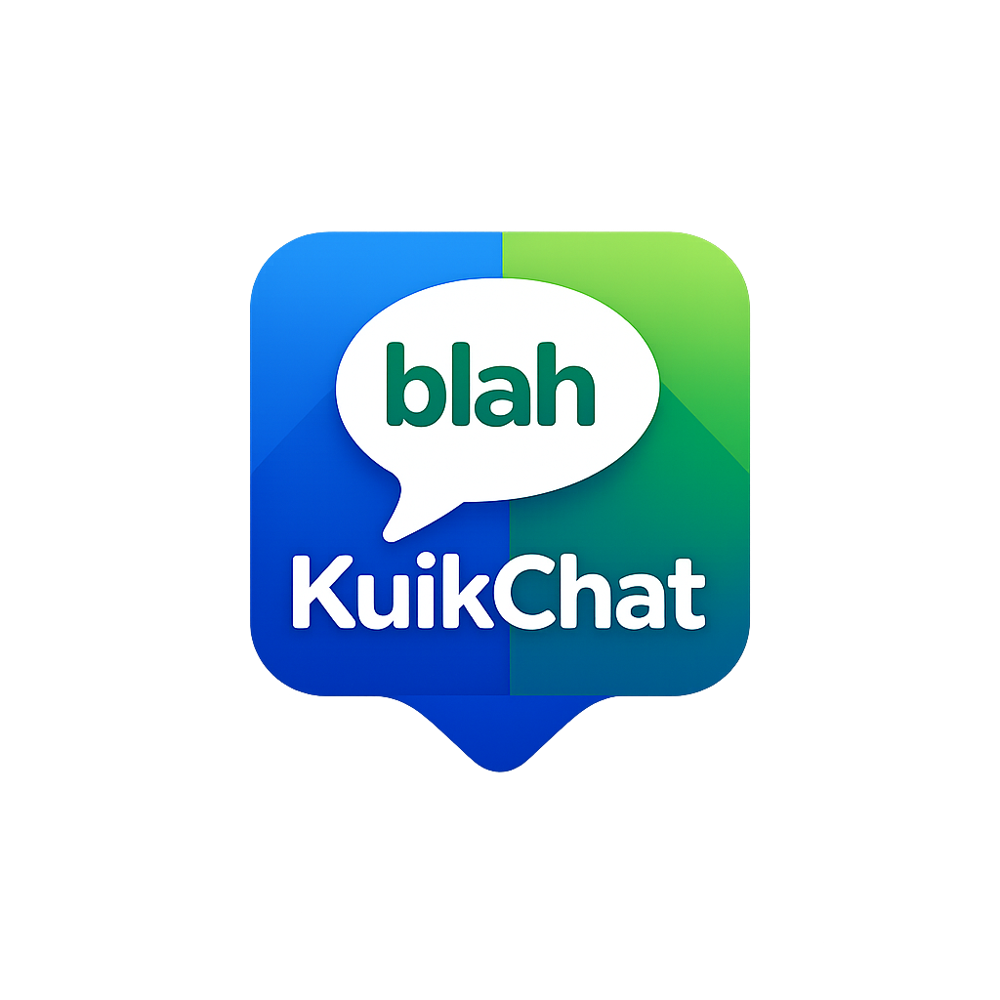

<div align="center">
  
  <h1>KuikChat</h1>
  <p><strong>The All-in-One Messenger + AI Agent Platform</strong></p>
  <p>The last messenger anyone will ever need to download.</p>

  <p>
    <a href="https://kuikchat.io">kuikchat.io</a> ·
    <a href="#features">Features</a> ·
    <a href="#getting-started">Getting Started</a> ·
    <a href="#tech-stack">Tech Stack</a>
  </p>
</div>

---

## ✨ Vision

KuikChat unifies every messaging experience into one sleek, secure, and intelligent app — powered by **Hermes AI**, built for personal and professional use, with **zero phone number requirement**.

---

## 🚀 Features (130+)

| Category | Highlights |
|---|---|
| 💬 **Messaging** | Real-time chat, edit/delete, replies, forwards, reactions, mentions, formatting, drafts, view-once, disappearing messages |
| 📞 **Voice & Video** | 1:1 + group (up to 42), screen share, recording, scheduled calls, AI noise cancellation, virtual backgrounds |
| 👥 **Groups & Communities** | 1,024-member groups, Discord-style topics, polls, events, slow mode, admin roles, Communities (super groups) |
| 🔐 **Privacy & Security** | E2E encryption (Signal Protocol), chat lock, ghost mode, secret chats, screen security, IP protection, 2FA |
| 🤖 **Hermes AI** | In-chat assistant, translation, summarization, tone rewriter, image generation, voice transcription, doc analysis, meeting notes |
| 📖 **Status & Stories** | 24h disappearing posts, close friends, music status, archive, per-story audience |
| 💼 **Professional Mode** | Business profile, catalog, quick replies, broadcast lists, labels, appointments, invoices, team inbox, analytics |
| 🌍 **Channels** | Public/private broadcast, paid subscriptions (Stripe), comments, reactions, scheduling, analytics |
| 🎨 **Fun & Expression** | AI-generated stickers, custom themes, chat wallpapers, GIFs, emoji avatars, AR camera filters |

---

## 🛠 Tech Stack

| Layer | Technology |
|---|---|
| **Framework** | [Next.js 14](https://nextjs.org/) (App Router) + TypeScript |
| **Styling** | [Tailwind CSS](https://tailwindcss.com/) + custom KuikChat brand tokens |
| **UI Primitives** | [Radix UI](https://www.radix-ui.com/) + shadcn-style wrappers |
| **Auth + DB + Realtime + Storage** | [Supabase](https://supabase.com/) |
| **AI (Hermes)** | [OpenAI](https://platform.openai.com/) (GPT-4o, DALL·E 3, Whisper) |
| **Payments** | [Stripe](https://stripe.com/) Subscriptions |
| **Voice/Video** | WebRTC (LiveKit planned for Phase 5) |
| **State** | Zustand + TanStack Query |
| **Icons** | Lucide React |
| **Animations** | Framer Motion |

---

## 📁 Project Structure

```
kuikchat/
├── public/                    # Static assets (logo.png — DO NOT replace)
├── src/
│   ├── app/
│   │   ├── (marketing)/       # Public landing, pricing, features, about
│   │   ├── (auth)/            # Login, signup, forgot/reset password
│   │   ├── (app)/             # Authenticated app shell
│   │   │   ├── chats/
│   │   │   ├── calls/
│   │   │   ├── status/
│   │   │   ├── channels/
│   │   │   ├── communities/
│   │   │   ├── hermes/
│   │   │   ├── contacts/
│   │   │   ├── professional/
│   │   │   └── settings/      # 9 nested settings pages
│   │   ├── api/
│   │   │   ├── hermes/        # AI: chat, image gen, transcription
│   │   │   └── stripe/        # checkout + webhook
│   │   └── auth/callback/     # OAuth callback handler
│   ├── components/
│   │   ├── ui/                # Reusable primitives (Button, Input, Card…)
│   │   ├── brand/             # Logo component
│   │   ├── marketing/         # Landing-page sections
│   │   ├── auth/              # LoginForm, SignupForm
│   │   ├── layout/            # Sidebar, MobileNav, UserMenu
│   │   ├── chat/              # ChatList, ChatWindow
│   │   └── settings/          # SettingsSection
│   ├── lib/
│   │   ├── supabase/          # Browser + server clients, middleware
│   │   ├── openai/            # Hermes AI helpers
│   │   ├── stripe/            # Stripe client + price IDs
│   │   ├── utils.ts
│   │   └── constants.ts       # Plans, feature flags, brand tokens
│   └── middleware.ts          # Auth route protection
├── supabase/
│   └── migrations/            # 9 SQL migration files (full schema + RLS + storage)
├── .env.local.example
├── package.json
├── tailwind.config.ts
├── next.config.js
└── tsconfig.json
```

---

## 🏁 Getting Started

### 1. Prerequisites

- **Node.js 18+**
- A free [Supabase](https://app.supabase.com/) project
- A [Stripe](https://dashboard.stripe.com/) account (test mode is fine)
- An [OpenAI](https://platform.openai.com/) API key

### 2. Install

```bash
git clone <your-repo> kuikchat
cd kuikchat
npm install
```

### 3. Configure environment

```bash
cp .env.local.example .env.local
# Edit .env.local with your real keys
```

### 4. Set up Supabase

1. Create a new project at [app.supabase.com](https://app.supabase.com/)
2. Go to **Settings → API** and copy:
   - `Project URL` → `NEXT_PUBLIC_SUPABASE_URL`
   - `anon public` → `NEXT_PUBLIC_SUPABASE_ANON_KEY`
   - `service_role` → `SUPABASE_SERVICE_ROLE_KEY`
3. Run the migrations (in order) in **SQL Editor**:

   ```
   supabase/migrations/001_users.sql
   supabase/migrations/002_chats_messages.sql
   supabase/migrations/003_groups_communities.sql
   supabase/migrations/004_status_stories.sql
   supabase/migrations/005_channels.sql
   supabase/migrations/006_calls.sql
   supabase/migrations/007_professional.sql
   supabase/migrations/008_rls_policies.sql
   supabase/migrations/009_storage_buckets.sql
   ```

   *Or use the Supabase CLI:* `supabase db push`

4. (Optional) **Authentication → Providers** → enable Google + Apple OAuth.

### 5. Set up Stripe

1. Create 4 recurring products in Stripe Dashboard:
   - **KuikChat Plus** — $4.99/mo
   - **KuikChat Pro** — $12.99/mo
   - **KuikChat Business** — $29.99/mo
   - **Hermes Pro** — $2.99/mo
2. Copy each Price ID into `.env.local`
3. Set up a webhook endpoint at `https://kuikchat.io/api/stripe/webhook` listening for:
   - `checkout.session.completed`
   - `customer.subscription.updated`
   - `customer.subscription.deleted`
   - `invoice.payment_failed`

### 6. Run

```bash
npm run dev
# → http://localhost:3100
```

---

## 🎨 Brand Guidelines

> **The KuikChat logo is sacred.**
> Always use `public/logo.png`. Never generate alternatives.

**Colors** (extracted from logo):

| Token | Hex |
|---|---|
| `brand-blue-500` | `#1E5BCB` |
| `brand-green-400` | `#5BC967` |
| `brand-teal-500` | `#1AAFA0` |
| `brand-gradient` | `linear-gradient(135deg, #1E5BCB 0%, #5BC967 100%)` |

---

## 📅 Roadmap

| Phase | Status | Focus |
|---|---|---|
| **Phase 1 — Foundation** | ✅ **Done** | UI scaffolds, auth, DB schema, Hermes API, Stripe scaffold |
| **Phase 2 — Messaging Core (Slice A & B)** | ✅ **Done** | Real-time messages, deduplication, optimistic UI, reactions |
| **Phase 3 — Rich Media & Attachments** | 🔜 Next | Media uploads, voice notes, attachment drawer, document system |
| **Phase 4 — Interactive Chat Features** | 🔜 | Polls, events, live location, contact sharing |
| **Phase 5 — Mobile-First Web UX** | 🔜 | Premium dark mode, glass effects, native-feeling animations, SVG icons |
| **Phase 6 — Business & AI** | 🔜 | Business mini-apps architecture, Hermes AI in-chat actions |
| **Phase 7 — Native Android App** | 🔜 | Foundation for dedicated Android app (not a web wrapper) |

### 📱 Mobile Vision & Design Philosophy

While the web app focuses on a clean, productivity-driven desktop experience, the upcoming native mobile apps will deliver a **premium, sleek, dark-mode experience** comparable to enterprise-grade messengers like WhatsApp or Telegram.

**Core Mobile Tenets:**
- **Premium Dark UI:** Black glass aesthetics, smooth modal/bottom-sheet transitions.
- **Professional Polish:** Exclusively SVG icon-based controls (no oversized/cheap emojis). Emoji restricted to actual message content and reaction pickers.
- **Native Interactions:** Fast open/close transitions, responsive gesture interactions, and consistent typography.
- **Privacy-First:** Clear E2E encryption notices, disappearing messages, and secure-device feel.

### 🌐 The KuikChat Ecosystem (FileNinja & Rev-Pro)

KuikChat is not just a messenger; it is designed to evolve into a unified ecosystem integrating **communication, AI, productivity, and business utilities**.

1. **FileNinja Integration (Native Professional File Delivery)**
   - KuikChat will handle enterprise-grade file sharing natively.
   - Features: Large file uploads, secure expiring links, encrypted business sharing, and upload progress tracking.
   - Flow: Uploading a large file generates a secure FileNinja delivery link directly in the chat for inline preview and download.
2. **Rev-Pro Integration (AI-Powered Media Utilities)**
   - KuikChat will integrate Rev-Pro's media intelligence natively.
   - Features: Paste TikTok/YouTube/X links for instant transcription/summarization, upload MP4s for AI captions, and convert voice notes to text.
   - Flow: Sending media or pasting video links automatically processes the content through Rev-Pro, returning transcripts, summaries, and translations seamlessly in the conversation.

See [TODO.md](./TODO.md) for the live progress board.

---

## 📡 Deployment

- **Domain**: `kuikchat.io`
- **Server IP**: `85.215.225.0`
- **Recommended**: Deploy via Vercel or self-host with Docker behind Cloudflare

---

## 📜 License

Proprietary — © KuikChat. All rights reserved.

---

<div align="center">
  <strong>Built with ❤️ — KuikChat is the last messenger you'll ever need.</strong>
</div>
